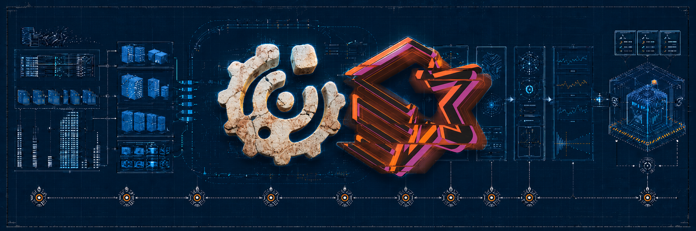

<div align="center">

# 🔭 Workshop Spark + sparkMeasure

### From native Spark evidence to explainable diagnostics, guardrails, and decisions

### 🎓 Training Program / Formação

**Apache Spark & Databricks Data Intelligence Platform**

</div>

<p align="center">
  
</p>

> [!IMPORTANT]
> This workshop is not a metric catalog or a collection of universal tuning
> rules. It provides a learning path for turning Spark execution evidence into
> explainable hypotheses, diagnostics, and engineering decisions.

---

## 🎯 Workshop objective

This repository provides a local platform and a practical learning path for
studying Apache Spark observability and workload performance with
[sparkMeasure](https://github.com/LucaCanali/sparkMeasure).

The workshop starts with one central question:

> **How can Spark execution evidence become an explainable diagnosis or
> decision without claiming more than the metrics actually support?**

Across the Labs, participants learn to:

- locate native evidence in execution plans, the Spark UI, and History Server;
- understand what sparkMeasure condenses;
- choose between `StageMetrics` and `TaskMetrics`;
- test hypotheses through controlled experiments;
- measure the cost of observability itself;
- build explainable workload fingerprints;
- turn metrics into operational policies;
- validate telemetry before using it in automation;
- track behavior, volume, and drift over time.

The goal is not to replace Spark expertise. It is to make that expertise more
observable, reproducible, and actionable.

### Intended audience

- data engineers who already understand Spark fundamentals;
- professionals interested in performance, observability, and reliability;
- teams connecting technical diagnostics with CI/CD and governance;
- instructors who need deterministic workloads for demonstrations.

> [!NOTE]
> The Labs revisit important Spark concepts, but the workshop is not intended
> to be a complete introduction to Apache Spark.

---

## 🧠 Mental model

A Spark workload is shaped by the interaction of three dimensions:

```text
SOURCES AND LAYOUTS
volume · distribution · files · partitions · skew
                        +
CODE AND CONFIGURATION
physical plan · joins · shuffle · parallelism · Spark configs
                        +
INFRASTRUCTURE
CPU · memory · disk · network · executors · concurrency
                        =
OBSERVED BEHAVIOR
runtime · shuffle · spill · GC · distribution · cost
```

Waste can remain hidden in small workloads. As volume, frequency, and
concurrency grow, small inefficiencies can produce meaningful operational
effects.

---

## 🏗️ Workshop architecture

```text
┌──────────────────────────────────────────────────────────────────────────────┐
│                         WORKSHOP SPARK + sparkMeasure                         │
└─────────────────────────────────────┬────────────────────────────────────────┘
                                      ▼
┌──────────────────────────────────────────────────────────────────────────────┐
│                         SCHEMA-FIRST DATA GENERATOR                          │
│      vendors · products · customers · sales · Lab 7 temporal source       │
└─────────────────────────────────────┬────────────────────────────────────────┘
                                      ▼
┌──────────────────────────────────────────────────────────────────────────────┐
│                                  MINIO                                       │
│    lakehouse/bronze · lakehouse/silver · lakehouse/gold · observability/     │
└─────────────────────────────────────┬────────────────────────────────────────┘
                                      ▼
┌────────────────────────────────────────────────────────────────────────────┐
│                         SPARK STANDALONE CLUSTER                              │
│        Spark Master · 2 default workers · optional third worker            │
│        workload + configuration + sparkMeasure + Delta Lake                │
└─────────────────────────────────────┬────────────────────────────────────────┘
                                      ▼
┌───────────────────┬──────────────────────┬───────────────────────────────────┐
│ Spark UI /        │ sparkMeasure         │ Delta observability               │
│ History Server    │ StageMetrics /       │ tables                              │
│                   │ TaskMetrics          │                                     │
└───────────────────┴──────────────────────┴───────────────────────────────────┘
                                      │
                                      ▼
           diagnosis → benchmark → fingerprint → policy → contract → history
```

| Component | Version or role |
| --- | --- |
| Apache Spark | `4.1.2`, Scala `2.13`, Java `17` |
| Delta Lake | `4.2.0` |
| sparkMeasure | Python `0.28.0`, JVM `0.28` |
| MinIO | local S3-compatible object storage |
| Spark History Server | reads event logs persisted in MinIO |
| Streamlit | optional read-only dashboard for Lab 7 |
| Docker Compose | orchestrates the local platform |

The shared runtime contract prioritizes classroom readability and fast workload
development over a production-grade platform framework. See
[Data platform tradeoffs](docs/architecture/data_plat.md) for the rationale.

Complete versions, recommended resources, and configurable ports are listed in
[Workshop requirements](docs/requirements.md).

---

## 🚀 Quick start

Before starting, read:

- [Workshop requirements](docs/requirements.md) for tools, versions, resources,
  and ports;
- [Bootstrap guide](docs/bootstrap-guide.md) for the complete flow, expected
  results, source generation, and cleanup.

Minimal flow from a clean clone:

```bash
make bootstrap
make build
make tests
make validate
make compose
make dry-test
make generate-all SCALE=xs GENERATOR_RUN_ID=workshop-sparkMeasures-lab1-6
make services
```

The complete flow prepares the shared retail sources for Labs 0–6 and the
isolated temporal source for Lab 7. Do not regenerate data between lessons while
the corresponding MinIO state is still available.

To stop or rebuild the environment, follow the cleanup section in the
[Bootstrap guide](docs/bootstrap-guide.md#12-clean-local-state).

---

## 🗺️ Learning path

The complete teaching argument, including transitions between lessons and the
difference between pedagogical and operational order, is documented in:

### ➡️ [Labs 0–7 learning path](src/apps/labs/LEARNING_PATH.md)

```text
native evidence
  → aggregate measurement and distribution
  → controlled experimentation
  → cost of observation
  → operational fingerprint
  → policy decision
  → contracted telemetry
  → temporal history and drift
```

| Lab | Main question | Capability built | Classroom guide |
| ---: | --- | --- | --- |
| 🧭 0 | What do Spark and sparkMeasure provide? | evidence inventory | [Lab 0](src/apps/labs/lab_0/guide_lab0.md) |
| 🔎 1 | When are StageMetrics enough? | diagnostic granularity | [Lab 1](src/apps/labs/lab_1/guide_lab1.md) |
| 🧪 2 | How can metric relationships be tested? | controlled experimentation | [Lab 2](src/apps/labs/lab_2/guide_lab2.md) |
| ⏱️ 3 | How much does observation cost? | overhead benchmark | [Lab 3](src/apps/labs/lab_3/guide_lab3.md) |
| 🧬 4 | How can a workload be described? | operational fingerprint | [Lab 4](src/apps/labs/lab_4/guide_lab4.md) |
| 🚦 5 | Does the candidate satisfy the policy? | runtime budget guardrail | [Lab 5](src/apps/labs/lab_5/guide_lab5.md) |
| 🛡️ 6 | Does the telemetry preserve enough context? | contract gate | [Lab 6](src/apps/labs/lab_6/guide_lab6.md) |
| 📈 7 | How does the workload change over time? | temporal history and drift | [Lab 7](src/apps/labs/lab_7/guide_lab7.md) |

Each guide contains the lesson flow, reasoning checkpoints, expected evidence,
limitations, and optional material. The root README does not duplicate those
runbooks.

---

## 🧩 Engineering principles

1. **Evidence before conclusions.** One metric does not establish root cause.
2. **Stage first.** TaskMetrics enter when the question depends on distribution
   across tasks.
3. **Compatibility before performance.** An operational change must preserve
   the relevant functional invariants.
4. **Thresholds belong to their context.** Values calibrated for the Labs are
   not universal rules for other workloads.
5. **Telemetry also needs a contract.** Schema, semantics, identity,
   availability, and correlation come before automation.
6. **Dashboards are lenses.** They make evidence visible but do not collect
   metrics or prove root cause.
7. **Automation amplifies decisions.** It requires ownership, boundaries,
   rollout, and rollback.

---

## 🏭 Capabilities the Labs can enable

The Labs build reasoning blocks. Real products require combining those blocks
with organizational context and operations.

| Possible solution | Related Labs | What would still be required |
| --- | --- | --- |
| CI/CD performance gate | Labs 2, 6, and 5 | orchestration, promotion, and an indeterminate state |
| Temporal observability | Labs 0, 6, and 7 | retention, baselines, and alerts |
| Operational dashboard | Labs 6 and 7 | time-series source, modeling, and governance |
| Cost intelligence | Labs 6 and 7 | ownership, prices, and economic units |
| Workload catalog | Lab 4 | identity, versioning, and ownership |
| Limited automation | Labs 5, 6, and 7 | owner, gradual rollout, boundaries, and rollback |

> **Possible does not mean delivered.** The workshop provides technical and
> conceptual foundations; it does not promise complete platform products.

---

## 🎬 Presentations

Three static decks support the narrative: the origin of sparkMeasure, its
internal mechanics, and an operational recap.

See the [Workshop presentation index](presentation/README.md) for the teaching
order, entry points, dedicated ports, and serving drill. That index is the
canonical source for exposing all three presentations during the workshop.

---

## 🗃️ Data generator

The schema-first generator creates related and deterministic Delta sources for
the experiments, including valid keys, configurable skew, and layout control.

- [Generator README](generator/README.md): usage and main scenario;
- [Retail schema contract](generator/configs/retail_sales_skew.yaml): schemas,
  relationships, distributions, and scales;
- [Data generator design](docs/design/data-generator-design.md): tradeoffs and
  the decision to use a Spark-native materializer.

sparkMeasure measures the workloads that consume these sources, not the data
generation process itself.

---

## 🌐 Local services

With the stack running, execute:

```bash
make services
```

The command prints the configured URLs for Spark Master, Spark History Server,
MinIO, and the Lab 7 dashboard. Defaults, local credentials, and overrides are
documented in [Workshop requirements](docs/requirements.md#default-local-ports)
and [`.env.example`](.env.example).

---

## 🪣 Storage organization

| Bucket | Responsibility |
| --- | --- |
| `lakehouse` | Bronze sources, Silver transformations, and Gold outputs |
| `tests` | validation datasets and artifacts |
| `observability` | event logs, metrics, fingerprints, decisions, and history |

S3 directories are prefixes and appear when data is materialized. Specific
paths belong in each Lab guide and its class notes.

---

## 📁 Repository structure

```text
workshop-spark-measures/
├── build/                    # Compose, images, and platform scripts
├── docs/                     # requirements, bootstrap, design, and research
├── generator/                # schema-first Spark-native generator
├── presentation/             # three static presentations
├── src/apps/labs/            # learning path and Labs 0–7
├── tests/                    # automated tests
├── .env.example              # versions, ports, and defaults
├── Makefile                  # main operational interface
└── README.md
```

---

## 📚 Documentation

| Document | When to use it |
| --- | --- |
| [Documentation index](docs/README.md) | find architecture, design, research, and archived material |
| [Workshop requirements](docs/requirements.md) | prepare tools, resources, versions, and ports |
| [Bootstrap guide](docs/bootstrap-guide.md) | prepare or clean the environment end to end |
| [Labs learning path](src/apps/labs/LEARNING_PATH.md) | understand the teaching argument across Labs 0–7 |
| [Workshop presentation index](presentation/README.md) | serve and navigate the three decks |
| [Generator README](generator/README.md) | generate and validate synthetic sources |

---

## ⚠️ Deliberate boundaries

This workshop does not promise:

- a universal tuning formula;
- thresholds that apply to every workload;
- an ideal cluster configuration;
- automatic root-cause diagnosis;
- that dashboards can replace investigation;
- that every organization should reach automation;
- a complete FinOps product;
- an automatic machine recommender.

The goal is to teach how to build enough evidence to make better decisions and
recognize when that evidence is still insufficient.

---

## 📖 References

- [Apache Spark](https://spark.apache.org/)
- [Spark Monitoring and Instrumentation](https://spark.apache.org/docs/latest/monitoring.html)
- [sparkMeasure](https://github.com/LucaCanali/sparkMeasure)
- [Delta Lake](https://delta.io/)
- [MinIO](https://min.io/)
- [Docker Compose](https://docs.docker.com/compose/)
- [Streamlit](https://streamlit.io/)

---

<div align="center">

## 👨‍💻 Author

Created and maintained by [Gabriel Philot](https://github.com/Gabriel-Philot).

**Understand → measure → explain → constrain → automate**

</div>
